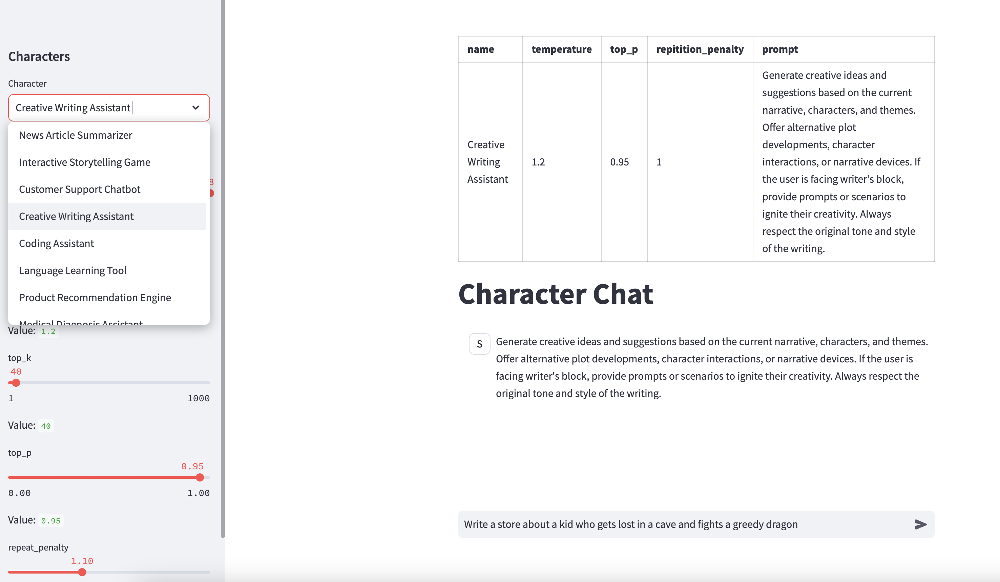

# Character Chat

Character-Chat is a project that aims to provide a platform to interact with large language models in the character of your choice. 
The goal of the project is to help understand the purpose and impact parameters of large language models, such as temperature, top_k, top_k, repeat_penalty etc.
The system uses the Llama Python wrapper to enable efficient serving of large language models, and the Streamlit framework for building a highly interactive user interface.

## Installation

1. **Conda environment**: This project uses a conda environment for managing dependencies. If you do not have Conda installed, follow the instructions [on the conda website](https://docs.conda.io/projects/conda/en/latest/user-guide/install/). 

    Create a new conda environment named `character-chat` using the following command:

    ```
    conda create --name character-chat
    ```

    Activate the environment:

    ```
    conda activate character-chat
    ```

2. **Clone the repository**: Clone the repository by executing the following command in your terminal:

    ```
    git clone 'https://github.com/vigyanik/character-chat'
    ```

    Navigate to the cloned directory:

    ```
    cd character-chat
    ```

3. **Install the dependencies**: Execute the following command to install the required python packages:

    ```
    pip install -r requirements.txt
    ```

4. **Install text-generation-webui**:
   text-generation-webui is tool that helps run almost all the available open source models. It also runs these models with an API that we can use in character-chat.
   See installation instructions at the [text-generation-webui page](https://github.com/oobabooga/text-generation-webui). Use either the one-click installation or manual installation using conda to install text-generation-webui.
   If you use the one-click installation, we recommend using the `base` conda environment and not the `character-chat` environment created above.
   If you choose manual installation, we recommend creating a new conda environment and not the `character-chat` environment created above.
5. **(Optional) Run the model-deployer**: To add the best model to text-generation-webui, based on your system and environment, you can run the following script
   ```
   python3 ./model-deployer.py
   ```
   It will output summary statistics about your environment, and ask you to select the preferred model, and then install it into text-generation-webui
7. **Start the character-chat server**: In the character-chat conda environment, and in the character-chat directory your terminal, execute the following command to start the chat server:
    ```
    streamlit run ./chat.py
    ```
Navigate to the URL provided in the console to interact with the application. 
If everything looks good, you should see a status message "Connected to model API!"
Select a character from the list on the left and then start a conversation in the chat window. Feel free to tweak the parameters and observe their impact on the interaction.

## License

This project is subject to copyright. We are considering adding a permissive license in the future.
